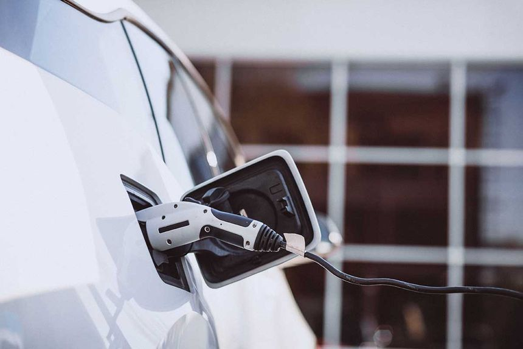

# Cotxes elèctrics i híbrids: Quina opció s'adapta millor a tu?

El sector de l'automoció està canviant ràpidament i cada vegada són més els conductors que es plantegen fer el salt a la mobilitat electrificada. A **Sobra Rodes** t'expliquem les diferències principals per ajudar-te a triar.

---

## 1. Cotxes Elèctrics 100% (BEV)

Són vehicles que funcionen exclusivament amb energia elèctrica emmagatzemada en una bateria.

* **Avantatges:** Zero emissions directes, etiqueta ZERO de la DGT, manteniment mecànic reduït i un estalvi notable en combustible.
* **Per a qui és ideal?** Conductors que fan molts quilòmetres urbans i disposen de punt de càrrega a casa o a la feina.

---

## 2. Híbrids Endollables (PHEV)

Combinen un motor de combustió amb un motor elèctric i una bateria de major capacitat que es pot carregar a la xarxa.

* **Avantatges:** Ofereixen autonomia elèctrica per als trajectes diaris i la tranquil·litat del motor de gasolina per als viatges llargs.
* **Per a qui és ideal?** Qui vol la versatilitat de l'etiqueta ZERO sense preocupar-se per l'autonomia en viatges de llarga distància.

---

## 3. Híbrids Autocarregables

Combinen un motor de combustió amb un motor elèctric i una bateria petita que es recarrega sola durant la conducció (frenades i desacceleracions), sense necessitat d'endollar el cotxe.

* **Avantatges:** Etiqueta ECO de la DGT, estalvi de combustible notable en ciutat i cap dependència de punts de càrrega ni endolls.
* **Per a qui és ideal?** Persones que busquen reduir el consum i tenir avantatges ambientals sense haver de canviar els seus hàbits ni instal·lar un carregador a casa.

---

## Quin triar?

A les instal·lacions de **Sobra Rodes** disposem d'una àmplia varietat de models electrificats perquè els puguis provar i rebre l'assessorament dels nostres especialistes.

[← Tornar a l'inici](index.md)
