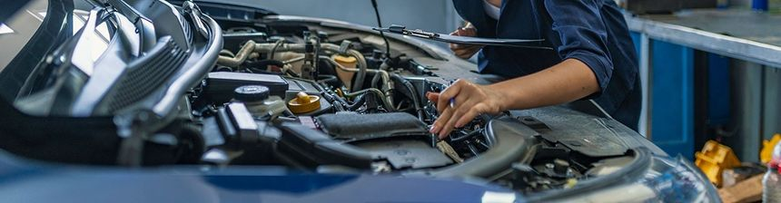

# 5 consells essencials per mantenir el teu cotxe com el primer dia

Un bo manteniment no només garanteix la teva seguretat a la carretera, sinó que també ajuda a conservar el valor del teu vehicle si el vols vendre en el futur a **Sobre Rodes**.

---

## Els 5 punts clau

1. **Control del nivell d'oli i líquids** 
   Comprova el nivell d'oli del motor, refrigerant i líquid de frens almenys una vegada al mes o abans de fer un viatge llarg.

2. **Pressió i estat dels pneumàtics** 
   Unes gomes amb la pressió incorrecta augmenten el consum de combustible i redueixen l'adherència. Revisa l'estat del dibuix regularment.

3. **Revisió del sistema de frens**
   Si notes sorolls estranys o el pedal perd tacte, visita el taller immediatament per revisar pastilles i discs.

4. **Substitució dels filtres a temps**
   Els filtres d'aire, habitacle i combustible s'han de canviar seguint les indicacions del fabricant per mantenir l'eficiència del motor.

5. **Cura exterior i interior**
   Netejar la carroseria i protegir la tapisseria de l'exposició solar directa ajuda a mantenir l'aspecte estètic original.

[← Tornar a l'inici](index.md)
