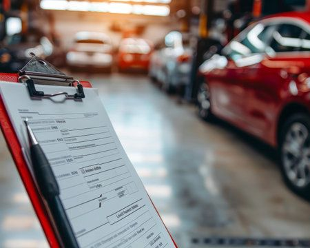

# Què has de revisar abans de comprar un cotxe de segona mà?

Comprar un vehicle d'ocasió és una opció excel·lent per aconseguir un bon cotxe a un preu competitiu. No obstant això, és important parar atenció a determinats detalls per assegurar una bona compra.

---

## Check-list per a la revisió

* **Historial de manteniment:** Comprova que el cotxe tingui el llibre de revisions al dia o les factures dels treballs realitzats.
* **Estat interior i desgast:** El desgast del volant, pedals i cadires ha de ser coherent amb el quilometratge del vehicle.
* **Prova de conducció:** Comprova el funcionament de la caixa de canvis, el tacte de la direcció i que no hi hagi sorolls rars a la suspensió.
* **Estat de la carroseria:** Revisa si hi ha diferències de color entre panells o junts desalineats, que podrien indicar cops previs.

---

## La tranquil·litat de comprar a Sobra Rodes

Tots els vehicles d'ocasió que trobaràs a **Sobra Rodes** han superat una inspecció completa de més de 150 punts i inclouen garantia oficial per a la teva tranquil·litat.

[← Tornar a l'inici](index.md)
