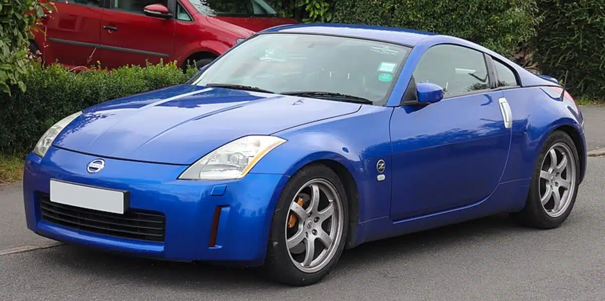

# Nissan 350Z

## Informació general

El **Nissan 350Z** és un esportiu japonès fabricat per Nissan.
És conegut pel seu motor V6, la tracció posterior i el seu disseny agressiu.

---

## Característiques

| Característica | Informació |
|---|---|
| Marca | Nissan |
| Model | 350Z |
| Motor | V6 3.5L |
| Cilindres | 6 |
| Potència | 313 CV |
| Parell màxim | 358 Nm |
| Acceleració 0-100 km/h | 5,2 segons |
| Velocitat màxima | 250 km/h |
| Tracció | Posterior |
| Transmissió | Manual / Automàtica |
| Places | 2 |

---

## Motor

El Nissan 350Z utilitza un motor **V6 atmosfèric de 3,5 litres**.

Aquest motor és un dels elements més característics del 350Z i ofereix
una resposta directa i un so esportiu.

### Rendiment

- **Potència:** 313 CV
- **Parell:** 358 Nm
- **0-100 km/h:** 5,2 segons
- **Velocitat màxima:** 250 km/h

---

## Disseny

El 350Z presenta un disseny baix i agressiu, amb una carrosseria ampla
i una part posterior característica dels esportius japonesos.

---

## Preu

El preu varia segons l'estat del vehicle, l'any i l'equipament.

**Preu aproximat:** 25.000 €

---

[← Tornar a l'inici](index.md)
